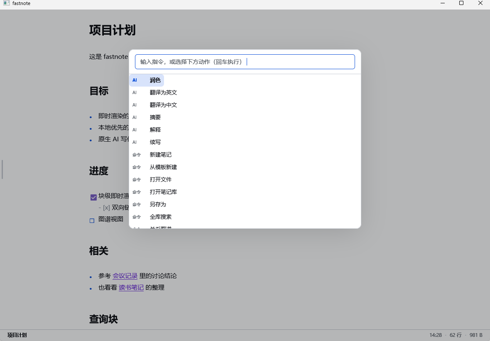
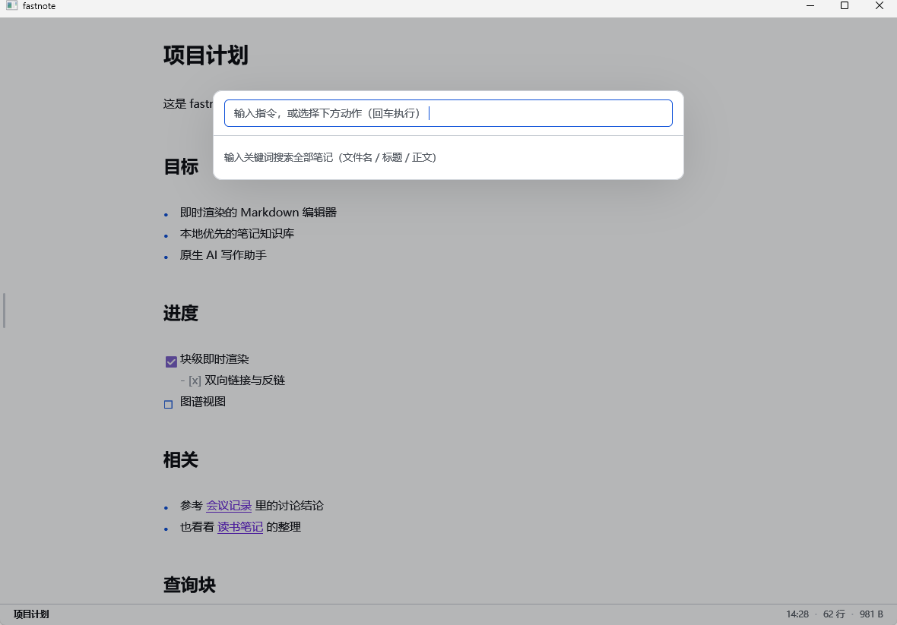
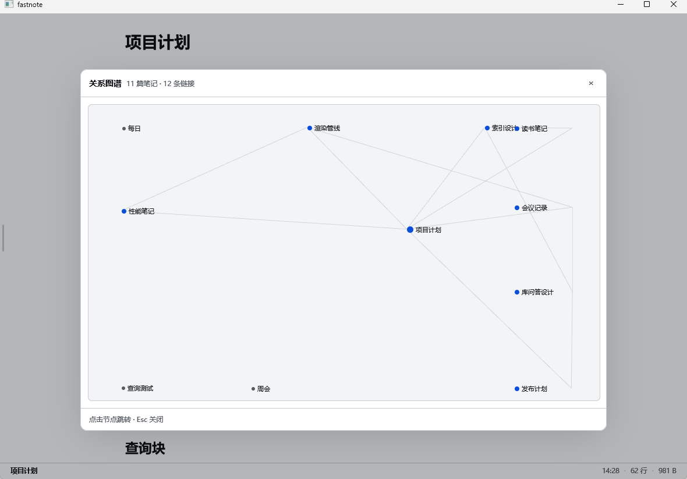
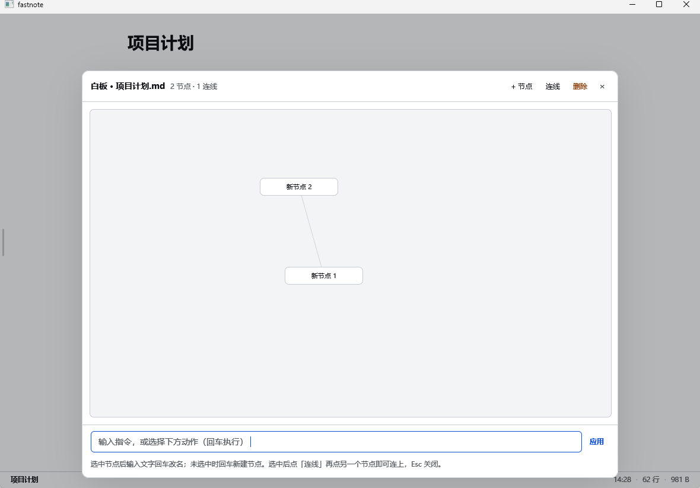
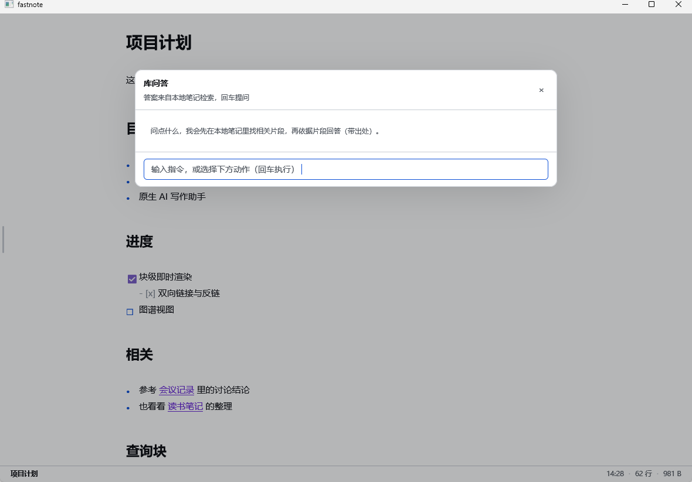
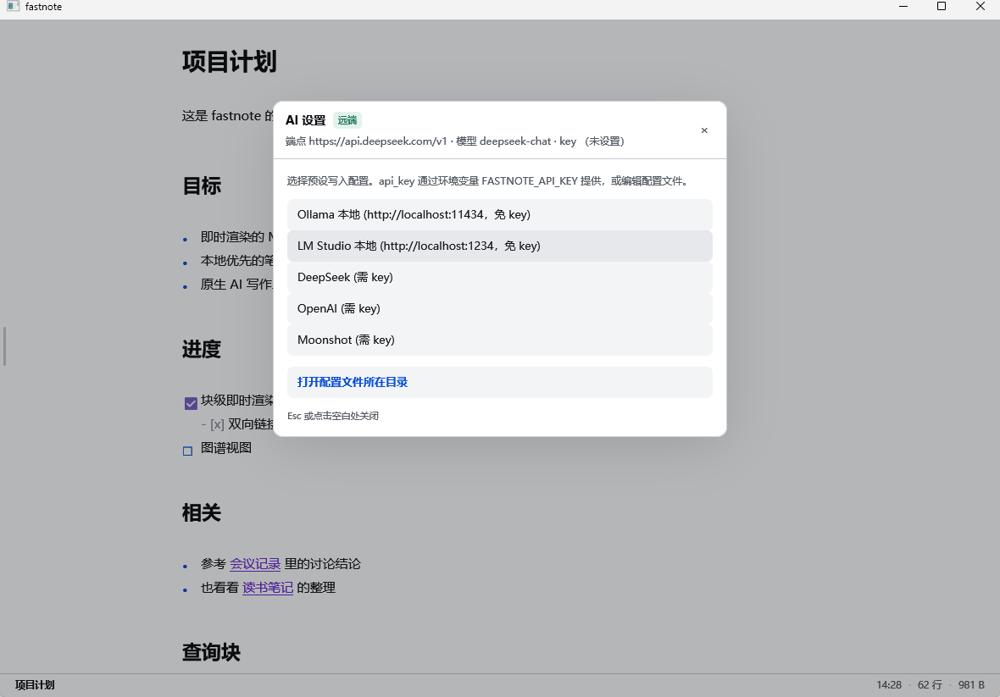
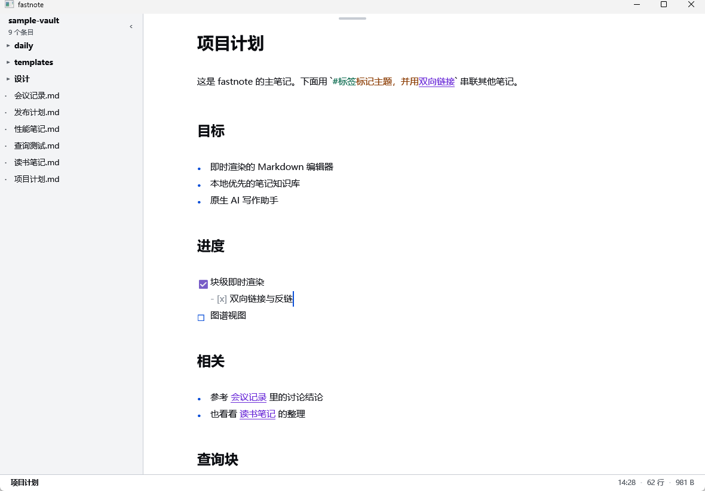
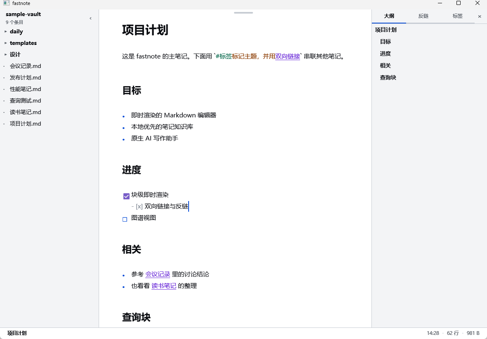

# fastnote

> 本地优先 · 即时渲染的 Markdown 笔记应用，内置双向链接、关系图谱与原生 AI 写作助手。
> A local-first, live-rendering Markdown note app with bidirectional links, a relation graph, and a native AI writing assistant.


---

## 特性 / Features

- **即时渲染（Live Preview）** — 离开光标的块渲染为富文本，光标所在块回退为可编辑源码，所见即所得且不丢 Markdown 结构。
- **双向链接与反链（[[Wikilinks]] & Backlinks）** — `[[笔记名]]` 串联知识，`反链`面板列出谁链接到了当前笔记。
- **标签与查询块（#tags & `query`）** — `#标签` 归类，` ```query ` 块离开光标后变成实时结果列表（`#标签 limit:5`、`link:项目计划`）。
- **关系图谱（Graph）** — 基于链接关系自动布局，一眼看清知识网络。
- **库问答（Vault Q&A）** — 先在本地检索相关片段，再交给 AI 作答，答案有据可循。
- **每日笔记（Daily Notes）** — `Ctrl+D` 一键打开/创建当天笔记，支持 `templates/每日.md` 模板。
- **白板（Whiteboard）** — 笔记里的 ` ```board ` 代码块即一张可拖拽的节点连线画布，改动自动存回笔记。
- **历史版本（History）** — 每次保存自动留档，可随时对比、恢复，且恢复前的版本也会留档，可反复退回。
- **原生 AI 写作** — 右键选中文本即可润色 / 翻译 / 摘要 / 解释，或行内续写；兼容任意 OpenAI 格式的端点（DeepSeek、OpenAI、Moonshot、Ollama、LM Studio…）。
- **高对比度、对色觉差异友好** — 交互状态以符号、字重、下划线区分，而非仅靠颜色。
- **本地优先、零云端依赖** — 笔记就是纯 `.md` 文件，AI 不配置也能正常记笔记。

---

## 截图 / Screenshots

| 默认界面 | 命令面板 | 全库搜索 |
| --- | --- | --- |
|  |  |  |

| 关系图谱 | 白板 | 库问答 |
| --- | --- | --- |
|  |  |  |

| 设置（AI 端点） | 侧栏笔记库 | 知识面板 |
| --- | --- | --- |
|  |  |  |

更多界面见 [`docs/ui/`](docs/ui/)。

---

## 架构 / Architecture

Rust workspace，三个 crate 各司其职，核心引擎与 GUI 完全解耦：

| Crate | 职责 |
| --- | --- |
| `fastnote-core` | 与界面无关的文本层：Rope 存储、块级/行内 Markdown 解析、笔记库文件树、索引（链接/标签/搜索/图谱）、模板、白板、历史。可脱离 GUI 单测。 |
| `fastnote-ai` | AI 端点配置与调用（OpenAI `/chat/completions` 兼容），文件优先、环境变量覆盖。 |
| `fastnote-app` | GPUI 0.2.2 桌面界面：窗口布局、编辑器视图、命令面板、图谱/白板/问答/历史浮层等。产物二进制名为 `fastnote`。 |

```
crates/
  core/   纯文本引擎（无 GUI 依赖）
  ai/     AI 配置与请求
  app/    GPUI 界面与二进制入口
sample-vault/   示例笔记库（可放心打开试用）
docs/ui/        界面截图（README 用）
```

---

## 快速开始 / Getting Started

### 前置条件 / Prerequisites

- **Rust 1.85+**（[rustup](https://rustup.rs/) 安装，`rustup update` 到最新稳定版）
- **Windows**：GPUI 依赖系统WebView2 / Visual C++ 运行库，通常已随系统具备。
- Git

### 获取与运行 / Build & Run

```bash
git clone https://github.com/menghuiguli/fastnote.git
cd fastnote

# 开发运行（debug，保留控制台便于看 panic）
cargo run --bin fastnote

# 发布构建（LTO + 单编译单元 + panic=abort，体积小、启动快）
cargo build --release
# 产物：target/release/fastnote.exe
```

首次启动会打开一篇欢迎笔记；按 `Ctrl+Shift+O` 打开一个本地目录作为笔记库，或直接用 `sample-vault/` 体验。

> 发布构建在 `Cargo.toml` 中启用了 `lto = "fat"` 与 `codegen-units = 1`，首次编译较慢但产物更优；开发期依赖也按 `opt-level = 3` 编译，保证 GPU 渲染与 Rope 操作在 debug 下不卡顿。

---

## AI 配置 / AI Setup

AI 功能可选。未配置时仅降级关闭 AI，编辑器照常使用。

### 方式一：设置面板（推荐）

打开 **设置**（`Ctrl+Shift+,`），从预设里一键选用：

| 预设 | 端点 | 说明 |
| --- | --- | --- |
| Ollama 本地 | `http://localhost:11434/v1` | 免 key |
| LM Studio 本地 | `http://localhost:1234/v1` | 免 key |
| DeepSeek | `https://api.deepseek.com/v1` | 需 key |
| OpenAI | `https://api.openai.com/v1` | 需 key |
| Moonshot | `https://api.moonshot.cn/v1` | 需 key |

任意兼容 OpenAI `/chat/completions` 规范的端点都能接（包括本地的 Ollama / LM Studio）。

### 方式二：环境变量（便于临时切换）

```
FASTNOTE_BASE_URL   # 例如 https://api.deepseek.com/v1
FASTNOTE_API_KEY    # 远端端点必填；本地端点可空
FASTNOTE_MODEL      # 例如 deepseek-chat
```

环境变量优先级高于配置文件。配置文件落在：

- Windows：`%APPDATA%/fastnote/config.json`
- macOS / Linux：`$XDG_CONFIG_HOME/fastnote/config.json` 或 `~/.config/fastnote/config.json`

---

## 快捷键 / Keyboard Shortcuts

应用内按 `Ctrl+?` 随时查看。`Esc` 或点击空白关闭任意浮层。

### 文件 / File

| 操作 | 快捷键 |
| --- | --- |
| 打开文件 | `Ctrl+O` |
| 打开笔记库 | `Ctrl+Shift+O` |
| 新建笔记 | `Ctrl+N` |
| 保存 | `Ctrl+S` |
| 另存为 | `Ctrl+Shift+S` |

### 编辑 / Edit

| 操作 | 快捷键 |
| --- | --- |
| 移动光标 | `↑ ↓ ← →` |
| 按词移动 | `Ctrl+←` / `Ctrl+→` |
| 行首 / 行尾 | `Home` / `End` |
| 文档首 / 尾 | `Ctrl+Home` / `Ctrl+End` |
| 选择文本 | `Shift+方向键` |
| 全选 | `Ctrl+A` |
| 缩进 / 反缩进 | `Tab` / `Shift+Tab` |
| 撤销 / 重做 | `Ctrl+Z` / `Ctrl+Shift+Z` |
| 复制 / 剪切 / 粘贴 | `Ctrl+C` / `Ctrl+X` / `Ctrl+V` |
| 切换待办勾选 | `Ctrl+Enter` |
| 加粗 / 斜体 / 行内代码 | `Ctrl+B` / `Ctrl+I` / `Ctrl+Shift+\`` |

### 视图 / View

| 操作 | 快捷键 |
| --- | --- |
| 顶部工具条（鼠标贴窗口顶端浮现） | 鼠标悬停 |
| 顶栏常显 / 收起 | `Ctrl+Shift+M` |
| 收起 / 展开侧栏 | `Ctrl+\` |
| 切换深 / 浅色 | `Ctrl+Shift+L` |
| 聚焦编辑区 | `Ctrl+Shift+E` |
| 切换知识面板 | `Ctrl+Shift+R` |

### 知识库 / Knowledge

| 操作 | 快捷键 |
| --- | --- |
| 全库搜索 | `Ctrl+Shift+F` |
| 关系图谱 | `Ctrl+Shift+G` |
| 每日笔记 | `Ctrl+D` |
| 库问答 | `Ctrl+Shift+Q` |
| 白板 | `Ctrl+Shift+B` |
| 历史版本 | `Ctrl+Shift+H` |

### AI 与命令 / AI & Command

| 操作 | 快捷键 |
| --- | --- |
| 打开 AI 设置 | `Ctrl+Shift+,` |
| 命令面板 | `Ctrl+K` |
| 采纳 AI 续写 | `Alt+Tab` |
| 忽略 AI 续写 | `Esc` |
| 打开本帮助 | `Ctrl+?` |

---

## 笔记库格式 / Vault Format

fastnote 的笔记就是普通 Markdown 文件，库是一个本地目录：

- **双向链接**：`[[笔记名]]`（无需扩展名），点击在笔记间跳转。
- **标签**：`#标签`，右侧 `标签` 面板按篇数聚合，点击即搜。
- **查询块**：` ```query ` 后跟查询语句，离焦后渲染为实时列表：
  - `#标签 limit:5` — 带某标签的最新笔记
  - `link:项目计划` — 链接到「项目计划」的笔记
- **白板**：` ```board ` 代码块内嵌 JSON 描述的节点与连线，点 `白板` 浮层可视化编辑，改动写回笔记。
- **模板**：库内 `templates/` 目录下的 `.md` 会出现在命令面板「模板」分组；支持 `{{date}}`、`{{title}}` 等变量。首次打开无模板的库会自动放入起步模板。
- **每日笔记**：`daily/` 目录按日期（`YYYY-MM-DD.md`）组织，`templates/每日.md` 可定制模板。
- **历史**：写盘前自动在 `.fastnote/history/` 留档，可对比恢复。

---

## 开发 / Development

```bash
cargo build            # 开发构建
cargo test             # 运行核心层单测（config / 解析等）
cargo run --bin fastnote
```

- 核心引擎（`fastnote-core`）不依赖任何 GUI/渲染库，可独立单测。
- 界面基于 **GPUI 0.2.2**，部分 API 与最新版有差异（如 `Div` 缺 `when` 条件包装、动作宏只接受裸标识符等），相关 workaround 已加注释。
- 发布构建见上文 `Cargo.toml` 的 `[profile.release]`。

---

## 许可证 / License

[MIT](LICENSE) © 2026 fujia

---

*本项目为个人知识管理工具，欢迎 Issue 与 PR。*
